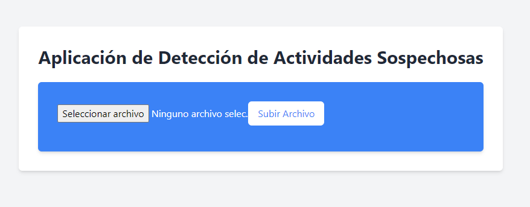

```markdown
# Aplicación de Detección de Actividades Sospechosas

Esta es una aplicación simple que permite cargar archivos CSV de actividades físicas, detectar actividades sospechosas y mostrar los resultados.



## Características

- **Subida de Archivos**: Permite a los usuarios cargar archivos CSV con datos de actividades físicas.
- **Detección de Actividades Sospechosas**: Analiza las actividades cargadas y detecta aquellas que cumplen ciertos criterios sospechosos.
- **Interfaz de Usuario Amigable**: Proporciona una interfaz sencilla para cargar archivos y visualizar las actividades sospechosas.

## Tecnologías Utilizadas

- **Frontend**: React.js
- **Backend**: Go (Golang)
- **Estilos**: Tailwind CSS

## Instrucciones de Uso

1. Clona este repositorio:

```bash
git clone https://github.com/tu-usuario/nombre-del-repositorio.git
cd nombre-del-repositorio
```

2. Instala las dependencias del frontend:

```bash
npm install
```

3. Instala las dependencias del backend:

```bash
cd physical_activities_server
go get
```

4. Inicia el frontend y el backend (asegúrate de tener ambos entornos en ejecución):

```bash
# En el directorio frontend/
npm start

# En el directorio backend/
go run main.go
```

5. Abre tu navegador y visita `http://localhost:3000` para acceder a la aplicación.

## Licencia
Este proyecto está bajo la Licencia MIT. Consulta el archivo [LICENSE](LICENSE) para más detalles.
```